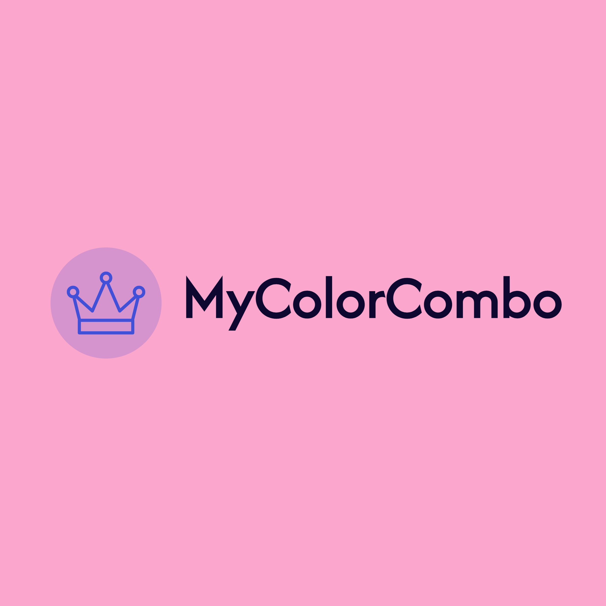

# MyColorCombo

# 概要
このアプリは、色彩理論を基に色の組み合わせを提案するほか、他のユーザーと共有できるWebアプリケーションです。ユーザーは、提案された色の組み合わせ、その組み合わせを基に作成した画像、感想を投稿し、他のユーザーと交流することができます。さらに、目的や使いたい色が同じ他のユーザーが作成した画像を検索、閲覧することができます。
## アプリテーマ
「色の組み合わせを考える」（考案中）
## テーマを選んだ理由
昨今、SNSや動画サイトで活動するインフルエンサーが多数参入しているところですが、発信に使用する画像や動画を作成するにあたっては、どうすれば閲覧者、視聴者に効果的に伝わるデザインにできるか悩むことが多いのではないかと感じます。また、職場内でプレゼンテーション等の資料作成にあたっても、色使いによって伝わり方が変わることから配色を考えることは重要と考えます。当アプリでは、目的に沿った色の組み合わせが簡単な操作でわかり、さらにアプリ上で他のユーザーとの共有もできる仕組みを提供します。
### きっかけ
自分自身もかねてからSNS投稿に使用する画像のデザインに悩むことが度々ありました。そんな中、興味があり、色彩検定及びカラーコーディネーターを取得した際に色の組み合わせには法則があることを学び、色に精通している人以外にも手軽に色使いがわかるようなアプリを作りたいと思いました。
### 問題点
  * 書籍等で色彩理論がわかる資料は多々あるが、該当ページから該当の色まで調べる作業は多忙なインフルエンサーや社会人にとっては負担となる
  * 色の組み合わせが分かっても全体のデザインが思い浮かばない
  * 画像を作成したはいいものの、同じ作成者側からの反応が気になる
### 解決策
  * 使いたい色と想定イメージを選ぶことで適切な組み合わせがすぐにわかる
  * 同じ色や想定イメージを選んだ他のユーザーの画像の作成例が検索できる
  * 投稿された画面で閲覧者数及びいいね数が表示される
# ターゲットユーザ
  * SNSや動画サイトで活動し始めたインフルエンサー
  * プレゼンテーションで効果的な資料を作りたい社会人
  * 色を主としたデザインをテーマに広く交流したい人
# 主な利用シーン
  * SNSや動画サイト投稿：
  * 
# 利用方法
  * ユーザー新規登録を行う、またはログインする

  * パレットから使いたい色と想定イメージを選択すると最適な組み合わせを提案する
  * 
  * 提案された組み合わせとそれを活用して実際に作成した画像データを投稿

  * 他のユーザーの投稿を閲覧し、気に入った投稿に「いいね」や「コメント」を残す

  * キーワード検索を使い、使いたい色や想定イメージが同じ他のユーザーの作成例を閲覧する
# 機能一覧
・基本的なCRUD機能  
・ユーザー認証機能(devise)  
・画像アップロード機能(Refile)  
・いいね機能  
・コメント機能  
・フォローフォロワー機能  
・DM機能  
・下書き機能  
・検索機能  
・閲覧数表示機能  
・バリデーション  
・ページネーション  
・レスポンシブ対応  
# 開発環境
・OS：Mac + ターミナル  
・言語：HTML、CSS、JavaScript、Ruby  
・フレームワーク：Ruby on Rails  
・JSライブラリ：jQuery  
・データベース：PostgreSQL  
